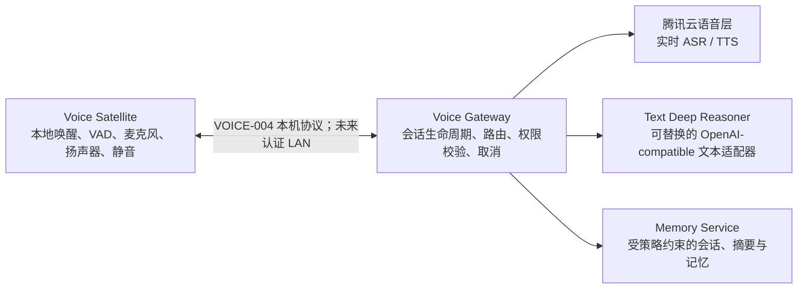

# Sol Home Assistant

> 一个面向单房间、单已授权用户的家庭 AI 助手：隐私优先、语音优先、文档驱动。

**项目状态：** 早期工程原型。Sol 还不是可以直接购买或安装的智能音箱，也不是生产级的家庭自动化系统。

Sol 想验证的是一件看似简单、实际需要清晰边界的事：家庭助手能否自然对话，同时不把每一段音频、每次聊天和每个偏好都变成不透明的云端数据。为此，项目把音频入口、会话控制、模型调用、记忆和未来的家庭工具分开设计，让每一层都能被替换、评测和审计。

## Sol 想实现的体验

> 说“Hi Sol” → 本地唤醒 → 自然说话 → 随时打断 → 得到有用回答 → 只有明确允许的信息才成为长期记忆。

Sol 不假定某一个模型或供应商可以安全地同时处理音频、推理、记忆和家庭操作。每项职责都有独立边界。

## 当前进展

| 模块 | 状态 | 已经可以验证的内容 |
| --- | --- | --- |
| 语音会话核心 | 已实现 | 确定性的会话状态机、分阶段超时、取消传播、脱敏指标和本地诊断演示。 |
| 文本深度推理适配器 | 已验证 | OpenAI-compatible 的纯文本适配器，包含模型探测、流式输出、取消、错误分类与本机私有配置。 |
| 腾讯云实时 ASR/TTS 适配器 | 已验证 | 自动化、真实 TTS→ASR 指标、独立取消和控制台用量复核均已通过。 |
| macOS 麦克风与扬声器 | 已实现，单轮已实测 | Swift/AVFoundation 宿主、同机二进制协议和真实麦克风→云端→扬声器中文单轮均已通过；手动打断和设备切换仍待实测。 |
| 唤醒词、VAD、AEC 与免手连续对话 | 计划中 | VOICE-004 真实硬件验收后由 VOICE-005 独立设计和房间实测。 |
| 长期记忆 | 计划中 | 保留策略、数据模型、删除语义和审计边界已经先行定义。 |
| 智能家居写操作、联网搜索 | 不在 MVP 范围内 | 这些能力必须单独定义权限、确认、成本和审计规则。 |

一句话概括：文本推理与腾讯云实时语音已经完成真实验收，VOICE-004 也已完成 Mac mini 真实麦克风、云端推理和扬声器的中文单轮；下一步是验收手动打断、设备变化，再进入 VOICE-005。

## 架构一览



这张图最重要的不是组件数量，而是边界：

- 音频在本地唤醒前留在设备上；未唤醒音频不得离开 Voice Satellite。
- 只有 Voice Gateway 持有云服务和数据库凭据。
- 文本推理层只接收最终转写，以及策略允许时的最小化摘要；绝不接收原始音频、部分转写、完整历史或其他提供方凭据。
- 记忆不是“把所有对话存起来”。长期写入必须经过明确策略，并支持审计和删除。

## 现在可以怎样体验

环境要求：Node.js 22 或更高版本，以及 npm。

```bash
npm install
npm run check
npm run demo
```

`npm run demo` 是刻意保持本地、确定性的开发诊断：它模拟 ASR、文本推理、TTS 与播放，用来验证会话生命周期；它不会访问麦克风、腾讯云或真实模型提供方。

在安装 Xcode/Swift 的 macOS 上，还可以运行 `npm run check:voice-satellite`。它会编译并测试原生 Satellite，并启动真实 Swift 子进程完成无麦克风、无云调用的协议冒烟；它不会请求麦克风权限。

### 可选：验证自己的文本推理提供方

如果你有 OpenAI-compatible 的文本 endpoint，可从 [`.env.example`](.env.example) 创建私有 `.env`，填入 `TEXT_REASONER_*` 配置后运行：

```bash
npm run probe:text-reasoner
```

该探测只使用固定短提示，并只输出安全的能力元数据和延迟统计。`.env` 已被 Git 忽略；不要提交密钥、endpoint、转写内容或模型回复。

### 可选：离线检查腾讯云语音配置与签名

在私有 `.env` 填入 `TENCENT_*` 配置后，可以运行：

```bash
npm run probe:tencent-voice
```

默认命令只校验配置和签名形状，输出 `networkAttempted: false`，不会连接腾讯云。真实调用还需要显式的 `--confirm-billable` 参数，并且只能在确认密钥、权限、余额/后付费边界和本轮授权后执行。

## 路线图

1. 完成 VOICE-004 真实验收：Mac mini 的麦克风/扬声器、云端单轮闭环、设备变化与手动打断。
2. 实现 VOICE-005：本地唤醒、自动 VAD、AEC/降噪与免手连续对话。
3. 实现受策略约束的会话与记忆服务。
4. 在常驻 Mac mini 上验证房间声学、恢复能力、成本和延迟。
5. 在任何现实世界副作用之前，先加入低风险、只读的家庭集成。

详细里程碑与验收标准请看 [MVP 路线图](docs/mvp-plan.md)，不在 README 中重复维护。

## 文档与代码导航

| 想了解什么 | 从这里开始 |
| --- | --- |
| 项目当前状态和文档地图 | [文档入口](docs/START-HERE.md) |
| 系统边界与隐私模型 | [架构说明](docs/architecture.md) |
| 单项功能的设计与验证证据 | [功能规格](docs/features/README.md) |
| 提供方假设与验证边界 | [腾讯云 / 文本提供方说明](docs/providers/tencent-cloud.md) |
| Mac mini 与容器部署基线 | [macOS / OrbStack 部署说明](docs/deployment/macos-orbstack.md) |
| 重大选择为何如此决定 | [架构决策记录](docs/decisions/) |

当前代码刻意保持很小：

```text
apps/voice-gateway/       Gateway 的组合入口和提供方配置
apps/voice-satellite-macos/ Swift/AVFoundation 本机音频宿主与测试
packages/voice-session/   会话状态机与安全的适配器契约
packages/text-reasoner/   OpenAI-compatible 文本适配器与探测支持
packages/tencent-voice/   腾讯云实时 ASR/TTS 签名、协议适配器与安全探测
docs/                      产品边界、决策、规格和验收证据
```

## 贡献与设计纪律

这是一个文档优先的项目：每项功能在实现前，先用规格说明目标、隐私边界、失败语义和验收证据。README 只是公共概览；链接到的文档才是事实来源。

计划或实现非简单变更前，请从 [AGENTS.md](AGENTS.md) 和 [文档入口](docs/START-HERE.md) 开始。不要把语音提供方、记忆保留、搜索、智能家居控制或凭据作为临时代码改动直接加入。
